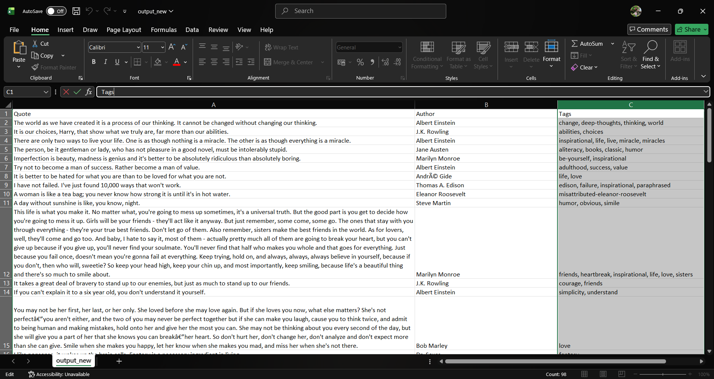
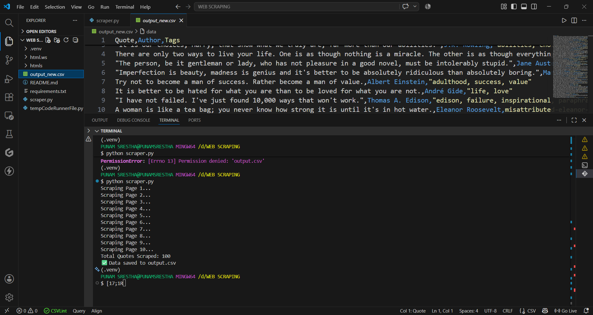

# Quotes Web Scraper

A Python web scraper that extracts quotes, authors, and tags from Quotes to Scrape website.

## Features

- Scrapes multiple pages
- Extracts quote text
- Extracts author names
- Extracts quote tags
- Saves data into CSV format

## Technologies Used

- Python
- Requests
- BeautifulSoup
- CSV

##Output Preview

